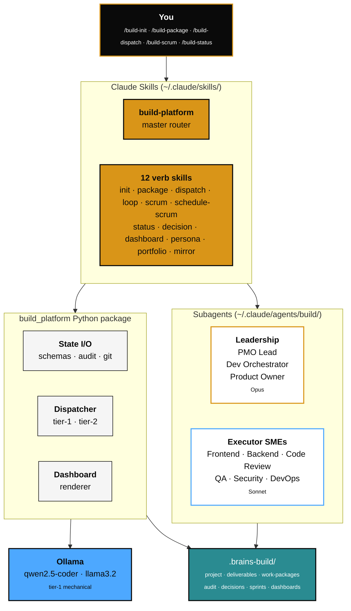

<div align="center">

<picture>
  <source media="(prefers-color-scheme: dark)" srcset="https://raw.githubusercontent.com/shard-BRAINS/.github/main/profile/brand-mark-dark-bg.png">
  
</picture>

# BRAINS Build Platform

### Agentic end-to-end software delivery, built under the BRAINS umbrella.

<br />

[](https://github.com/shard-BRAINS/BRAINS-build-platform/releases/tag/v0.1.0)
[](#run-the-tests)
[](#install)
[](LICENSE)
[](https://discord.gg/BEmTXXscBr)
[](https://github.com/shard-BRAINS)

<br />

[Install ↓](#install) · [How it works ↓](#how-it-works) · [The team ↓](#the-team) · [Quickstart ↓](#quickstart)

</div>

---

## What this is

The Build Platform turns any software project into a coordinated team of AI personas. A **PMO Lead** drives delivery, a **Dev Orchestrator** decomposes deliverables into work packages, and six executor SMEs — Frontend, Backend, Code Review, QA, Security, DevOps — write, review, and verify the code. Mechanical work routes to a local Ollama model. Judgement work routes to Claude subagents.

State lives in a `.brains-build/` folder inside your project. The dashboard at `.brains-build/dashboards/current.md` is the single source of truth — open it and you know where the build stands.

> **State on disk, not in heads.** Every status, every decision, every dispatch is recorded as a file. Every dispatch writes an audit entry. The PMO Lead reconstructs from evidence, not memory.

---

## Architecture



Three tiers, one rule per tier:

- **Skills** orchestrate. SKILL.md files stay thin; they tell Claude what to do, not how.
- **Subagents** judge. Each persona has a fixed remit, a tool allowlist, and an output contract.
- **Python** persists. Deterministic state, schema validation, audit, dashboard rendering.

---

## The team

Nine personas, all spawned as Claude subagents from `~/.claude/agents/build/`.

| Persona | Tier | Owns |
|---|---|---|
|  | Opus | Backlog state, sprint cadence, blocker escalation, dashboard refresh, scrum recap |
|  | Opus | Deliverables → work packages, tier-1/tier-2 tagging, technical coherence, executor sign-off |
|  | Opus | Project context, deliverable definitions, acceptance criteria, scope guard |
|  | Sonnet | UI components, styles, frontend tests, accessibility |
|  | Sonnet | Services, APIs, data layer, backend tests |
|  | Sonnet | Read-only review: architectural fit, style, codebase consistency before QA |
|  | Sonnet | Acceptance verification, integration/E2E tests, regression matrices, bug repro |
|  | Sonnet | Read-only audit: secret scan, dep audit, OWASP review, threat surface |
|  | Sonnet | CI/CD config, build scripts, deploy manifests, environment management |

---

## How it works

### Tier-1 — mechanical work, Ollama

A work package is tier-1 only if **all four** hold:

1. Touches ≤ 3 files, total < 50 KB
2. Single well-defined transformation (rename, format, scaffold, dep-bump, doc edit, mechanical refactor)
3. Acceptance is objectively checkable (lint passes, test passes, file matches pattern)
4. No new design decisions required

`/build-dispatch` sends it to Ollama (`qwen2.5-coder:7b`), validates the returned diff, and asks the Dev Orchestrator to review before apply. Two failed validations → the WP is blocked and surfaced in the next scrum.

### Tier-2 — judgement work, Claude SMEs

Everything else. `/build-dispatch` writes a structured brief to `.brains-build/runs/<wp-id>/tier2-brief.md`, then spawns the named executor SME subagent. The SME reads the brief, edits code, runs tests, and produces a result block. The **Code Review SME** then runs a read-only architectural / style pass; QA verifies acceptance; Security runs in parallel on sensitive WPs (auth, data, dependencies).

### The code-review gate

After tier-2 (and on tier-1 in `review-on-complete` / `auto` mode) the Code-Review SME returns a verdict. `dispatch_apply` records it in the audit entry; the loop respects it:

| Verdict | What happens | Exit code |
|---|---|---|
| `approve` | Apply continues normally; verdict + findings stored in the audit entry | `0` |
| `request-changes` | `dispatch_apply` skips the apply step and hands off to `dispatch_request_changes`: findings are written to `runs/<wp>/code-review.md`, the proposed diff is reset, the WP returns to `defined` for re-dispatch | `6` |
| `reject` | The apply step is skipped, the working tree is untouched, the WP is transitioned to `blocked`, and `/build-loop` will refuse to re-queue it until a later `approve` overrides the reject | `5` |

The verdict travels through the audit trail: `.brains-build/audit/<wp-id>-<ts>.md` for humans, and an append-only `.brains-build/audit/index.jsonl` for the loop's reject-gate and the dashboard's cost panel. Latest-by-timestamp wins, so a later `approve` legitimately overrides an earlier `reject` without manual file edits.

### Re-tiering on the way out of blocked

If a tier-1 dispatch fails twice (Ollama exhausted its retries), `/build-dispatch reject --retier` transitions the WP back to `defined` instead of leaving it `blocked`, ready for re-packaging via `/build-package` as tier-2. The audit captures the re-tier as a deliberate decision, not a stuck state.

### The weekly scrum

`/build-scrum` computes the since-last-scrum diff, writes a recap stub, then spawns the **PMO Lead** to fill in Progress · Blockers · Velocity · Re-prioritization · Next-up. Anything that needs human input renders as a `[USER ACTION]` block at the top of the recap.

---

## Autonomy modes — how much the platform decides on its own

Every work package carries an `autonomy` field that tells the platform how much human oversight you want for it. **You set it explicitly at packaging time; the default is the safest mode.** Choose per WP — a project can mix modes freely.

| Mode | What happens | What the platform can do without you | When to use |
|---|---|---|---|
| `manual` *(default)* | Every step pauses for your confirmation. Diffs need approval; QA verdicts need approval; state transitions need approval. | Read state. Propose. Show. Nothing applied without you. | Unfamiliar codebase. Judgement-heavy work. First time using the platform on a project. |
| `review-on-complete` | Executor runs to completion; the Code-Review SME runs automatically; then you review + approve before the next WP. | Read state. Edit code. Run tests. Run code-review. Stop at the gate and wait for you. | You trust the executor on this kind of work but still want a human signoff before merge. |
| `auto` *(tier-1 only)* | The `/build-loop` verb auto-dispatches the WP unattended. Diff is validated, applied, tests are run, Code-Review SME is invoked. Any failure → WP blocked, loop stops. | Read state. Edit code. Apply diffs. Run tests. Transition state. Refresh dashboard. **No code is pushed to a remote** unless the GitHub mirror is separately enabled. | Mechanical work you've explicitly pre-authorised: rename sweeps, doc edits, formatter runs, dependency bumps below your watermark. |

**Hard constraints (enforced by the CLI, not advisory):**

1. `auto` requires `tier == 1`. Judgement work (`tier-2`) cannot be auto-dispatched — it always spawns a Claude SME and waits for your review.
2. `auto` requires every `depends_on` WP to be `done`. Unmet deps make the WP ineligible for the loop.
3. The loop **stops on the first failure**. It does not retry, route around, or "fix" the failing WP. The WP is left `blocked` for you.
4. Code-Review SME runs on every `review-on-complete` and `auto` WP. You cannot opt out per WP — opt out by choosing `manual`.
5. The autonomy field controls **local** action. Remote actions (push to GitHub, open PRs) live behind the separate `/build-mirror` verb and the `github.enabled` config flag — they never fire from autonomy alone.

### Access implications — what you're authorising the agent to do

| Mode | Local file edits | Run shell tests | Git apply | Git push | Open PRs | Read secrets |
|---|---|---|---|---|---|---|
| `manual` | with your approval | with your approval | with your approval | no | no | no |
| `review-on-complete` | yes | yes | yes | no | no | no |
| `auto` | yes | yes | yes | no | no | no |

The platform never pushes to a remote, opens a PR, posts to GitHub, sends email, or reads secrets out of the box. Those capabilities only activate when you turn on the optional `/build-mirror` integration with an explicit owner + repo, and even then the mirror is one-way write (issues + milestones) — it does not run code on your behalf.

### Cost visibility

Every dispatch writes its tokens-in, tokens-out, and dollar cost into `.brains-build/audit/index.jsonl`. The dashboard's **Cost burn** panel rolls this up per persona and lifetime total. You can cap a session by setting `--limit` on `/build-loop` or by mixing autonomy modes (e.g., 3 mechanical WPs `auto`, the architectural one `manual`).

---

## Install

```powershell
git clone https://github.com/shard-BRAINS/BRAINS-build-platform.git c:\BRAINS_Build_Platform
cd c:\BRAINS_Build_Platform
python -m venv .venv
.venv\Scripts\Activate.ps1
pip install -e ".[dev]"
.\install.ps1
ollama pull qwen2.5-coder:7b
ollama pull llama3.2:3b
```

The installer copies the 13 skills to `~/.claude/skills/` and the 9 subagent definitions to `~/.claude/agents/build/`, then editable-installs the Python package.

---

## Quickstart

```powershell
mkdir c:\path\to\new-project
cd c:\path\to\new-project
# In Claude Code:
/build-init
```

`/build-init` is an interactive wizard. Once you have a project context, the loop is:

| Step | Verb | What happens |
|---|---|---|
| 1 | `/build-package` | Dev Orchestrator decomposes a deliverable into work packages, tagged tier-1 or tier-2 and assigned an autonomy mode (`manual` default, `review-on-complete`, or `auto`) |
| 2 | `/build-dispatch` | Tier-1 runs through Ollama; tier-2 spawns the named SME subagent. Code-Review SME runs on tier-2 before QA. |
| 3 | `/build-loop` *(optional)* | Burns down the `autonomy=auto` tier-1 queue unattended; stops on first failure |
| 4 | `/build-scrum` | PMO Lead writes the weekly recap, refreshes the dashboard, surfaces blockers |
| 5 | `/build-dashboard` | Render the current view at `.brains-build/dashboards/current.md` — includes autonomy column, pending-decisions inbox, cost burn |

Decisions are logged through `/build-decision`. Read-only queries through `/build-status`. For automatic weekly cadence, `/build-schedule-scrum` registers a remote routine via the `schedule` skill that pushes a notification to remind you when scrum is due.

---

## What's in the repo

```
BRAINS-build-platform/
├── src/build_platform/          # Python package
│   ├── schemas.py · state.py    # Pydantic models + read/write/validate
│   ├── audit.py · git_utils.py  # Audit trail + read-only git helpers
│   ├── ollama_client.py         # HTTP client + preflight + chat
│   ├── digest.py                # Token-saving pre-digest helper
│   ├── dispatcher.py            # Tier-1 (Ollama) + tier-2 (brief) paths
│   ├── render_dashboard.py      # Deterministic markdown renderer
│   ├── cli/                     # CLI verbs (init, package, package_edit, dispatch,
│   │                            #   dispatch_apply, dispatch_reject,
│   │                            #   dispatch_request_changes, loop, scrum,
│   │                            #   schedule_scrum, status, decision, dashboard,
│   │                            #   persona, portfolio, mirror, triage)
│   └── templates/               # Jinja templates for prompts, dashboards, audits
├── skills/build-*/SKILL.md      # 13 Claude skills (1 router + 12 verbs)
├── agents/build-*.md            # 9 subagent definitions
├── tests/                       # pytest suite (231 tests, 100% pass)
├── docs/superpowers/            # design spec + implementation plan
├── install.ps1                  # Installer (Windows / PowerShell)
└── pyproject.toml
```

Per-project state lives in `.brains-build/` inside the project you're building, **not** inside this repo.

---

## Run the tests

```powershell
.venv\Scripts\python -m pytest
```

```
231 passed in ~9 seconds
```

Includes an end-to-end smoke test that exercises `/build-init` → 3 WPs (1 tier-1, 2 tier-2) → 3 dispatches → scrum → dashboard render with Ollama mocked (see `tests/test_end_to_end.py`), plus a code-review-gate integration test that walks dispatch → approve / request-changes / reject across the audit trail and loop filter (see `tests/test_code_review_gate_integration.py`).

---

## Where this fits in BRAINS

This is a **BRAINS Incubator** project — internal tooling that's reusable across any project the Incubator runs. It's used to drive other Incubator builds and is available to community contributors who want to apply the same delivery model to their own work.

| | |
|---|---|
|  | New projects, partnerships, prototypes — see the [BRAINS org page](https://github.com/shard-BRAINS) |
|  | The first live Incubator project — [ND-aware résumé toolkit](https://github.com/shard-BRAINS/BRAINS-resume-skill) |
|  | Join the BRAINS Community — [discord.gg/BEmTXXscBr](https://discord.gg/BEmTXXscBr) |

If you'd like to use the platform on your own project, or contribute, see the Incubator application process at the [org page](https://github.com/shard-BRAINS#apply-to-join-the-incubator), or jump straight into [the Discord](https://discord.gg/BEmTXXscBr) to talk first.

---

## Design & plan

The design and implementation are public.

- [CLI reference](docs/cli-reference.md) — every verb, every option, every output shape
- [Design spec (2026-05-25)](docs/superpowers/specs/2026-05-25-brains-build-platform-design.md) — architecture, state model, persona contracts, MVP cut
- [Implementation plan (2026-05-25)](docs/superpowers/plans/2026-05-25-brains-build-platform.md) — 16 TDD tasks, full code, acceptance criteria

---

## Licence

Apache License 2.0 — see [LICENSE](LICENSE).

You may use, modify, and distribute this software in commercial and non-commercial settings, subject to the licence terms. The Apache 2.0 licence also provides an explicit patent grant from contributors.

---

<div align="center">

<br />

**Built by neurodivergent minds, for neurodivergent people.**

<br />

[](https://brainscertified.com)

</div>
